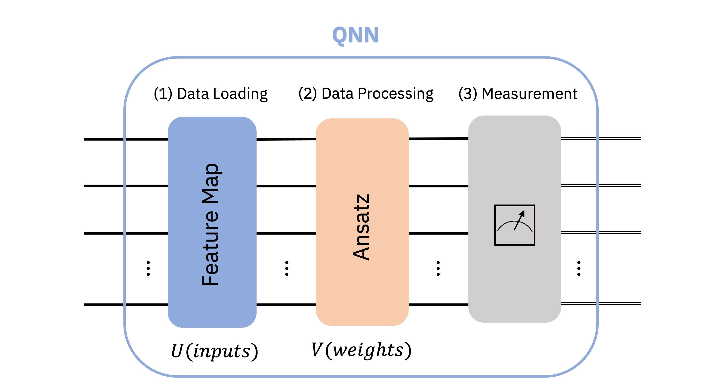

## 1. Introdución a las Redes Neuronales Cuánticas (QNN)
### 1.1 Redes Neuronales Cuánticas vs Redes Neuronales Clásicas

Las redes neuronales clásicas son modelos algorítmicos inspirados en el cerebro humano, que pueden entrenarse para reconocer patrones y resolver problemos complejos. Están compuestas por nodos interconectados, llamados neuronas, organizados en capas, y sus parámetros se ajustan mediante estrategias de aprendizaje automático o profundo.

El quantum machine learning (QML) busca combinar conceptos de computación cuántica y machine learning clásico para crear nuevos esquemas de aprendizaje. Las redes neuronales cuánticas (QNNs) son una integración entre redes neuronales clásicas y los circuitos cuánticos parametrizados. 

Las QNNs se pueden ser vistas desde dos perspectivas:

1. **Perspectiva de machine learning:** Las QNNs son modelos entrenables para detectar patrones en los datos, similares a las redes neuronales clásicas. Pueden cargar datos clásicos en un estado cuántico y procesarlos mediante puertas cuánticas paremetrizadas. Los resultados de estas mediciones se utilizan para entrenar los pesos mediante retroprogramación.
2. **Perpectiva de la computación cuántica:** Las QNNs son algoritmos cuánticos basados en circuitos cuánticos parametrizados. Estos circuitos incluyen un mapa de características (parámetros de entrada) y un ansatz (pesos ajustables).

Ambas perspectivas son complementarias, y no requieren definiciones estrictas de conceptos como "neuronas cuánticas" o las "capas" de una QNN.

### 1.2. Implementación en `qiskit-machine-learning`
En `qiskit-machine-learning`, las QNNs son unidades computacionales que se pueden adaptar a diferentes aplicaciones. Existen dos implementaciones principales:
* **[NeuralNetwork](https://qiskit-community.github.io/qiskit-machine-learning/stubs/qiskit_machine_learning.neural_networks.NeuralNetwork.html):** Interfaz para redes neuronales, una clase abstracta de la cual heredan las QNNs.
* **[EstimatorQNN](https://qiskit-community.github.io/qiskit-machine-learning/stubs/qiskit_machine_learning.neural_networks.EstimatorQNN.html):** Basada en la evaluación de observables mecánico-cuánticos.
* **[SamplerQNN](https://qiskit-community.github.io/qiskit-machine-learning/locale/fr_FR/stubs/qiskit_machine_learning.neural_networks.SamplerQNN.html):** Basada en muestras resultantes de la medición de un circuito cuántico.

Estas implementaciones se basan en los primitivos de Qiskit, que son el punto de entrada para ejecutar QNNs en simuladores o hardware cuántico real. Si no se proporciona una instancia del primitivo, la red crea una de forma automática.

Es importante destacar que las redes neuronales en qiskit-machine-learning no contienen capacidades de entrenamiento por sí solas, ya que estas se delegan a los algoritmos o aplicaciones específicos, como clasificadores o regresores.